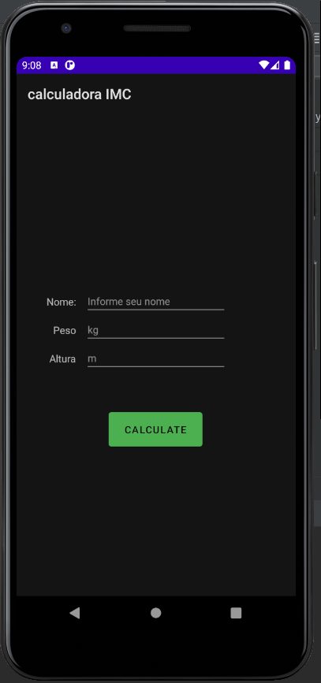
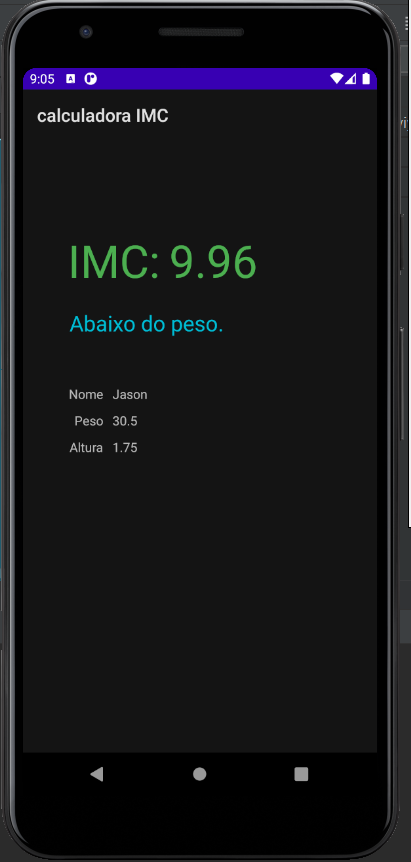
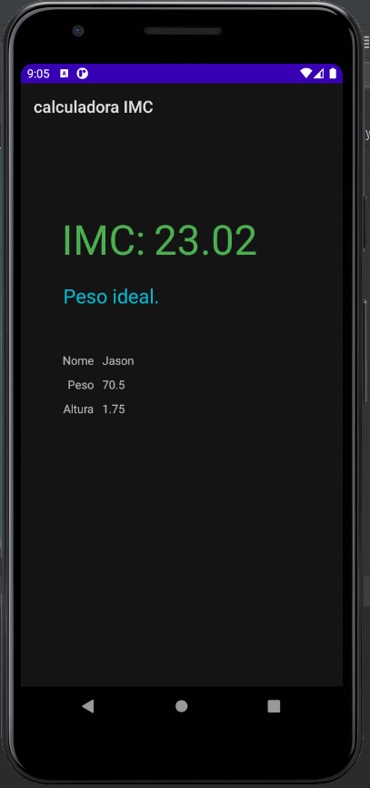
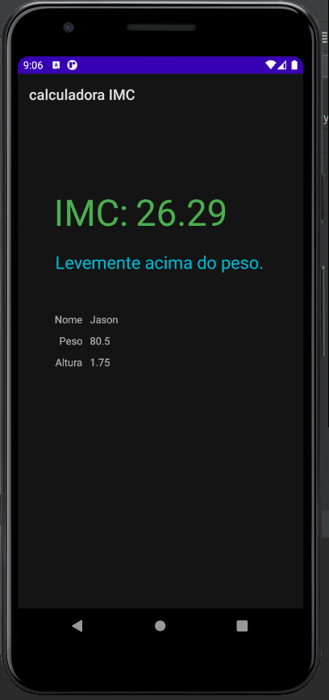
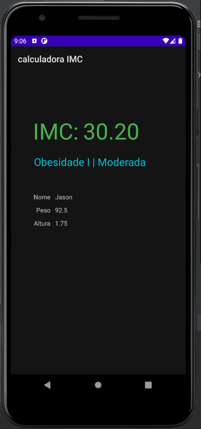
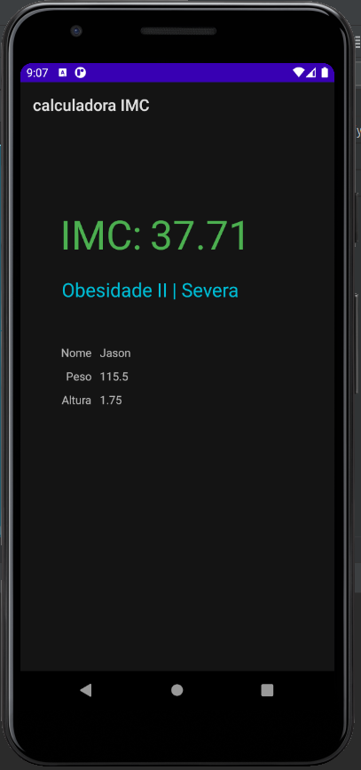
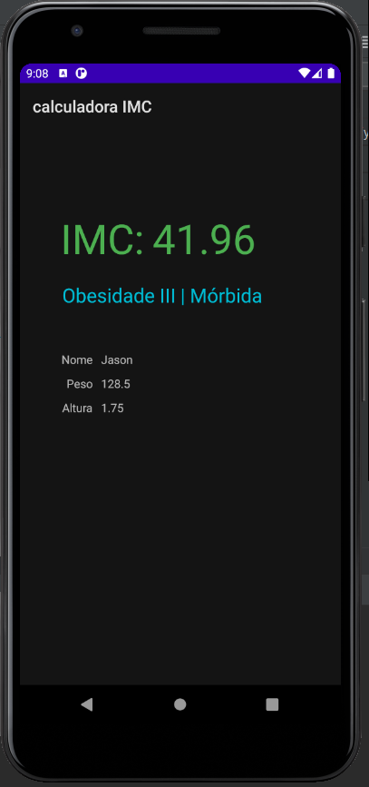

# App de Calculadora IMC

Segundo projeto desenvolvido durante a disciplina de Programação para Dispositivos Móveis, utilizando a IDE AndroidStudio e linguagem Java.

## Função

Calcular o IMC através do peso e altura informados.

## Descrição

- Estudamos sobre o uso das Activitys e como se relacionam com as telas da interface.

## Imagens do projeto

